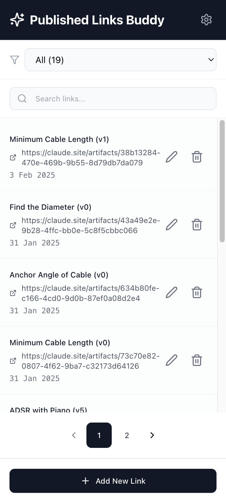
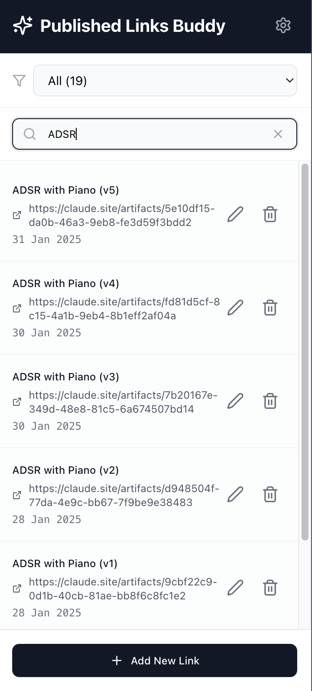
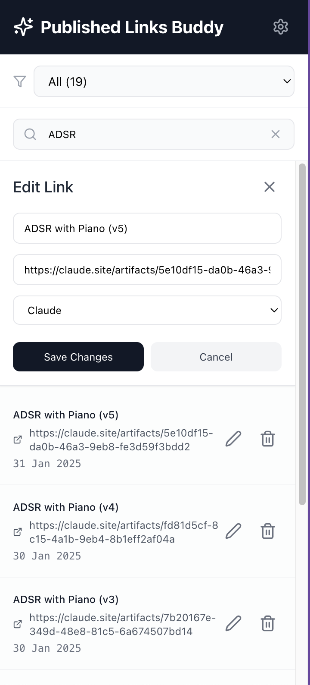

# Published Links Buddy 🚀


**Published Links Buddy** is your ultimate browser extension to save, organize, and manage links generated by publishing artifacts on AI platforms like Claude and GPT. Never lose track of those important shared links again! 🎉

## Features ✨

- 🔍 **Automatic Detection**: Tracks published artifacts and shared chats from Claude and GPT.  
- 🗂️ **Easy Management**: Store links locally, with options to name and categorize them.  
- 📋 **Side Panel Integration**: Quickly search, filter, and paginate through your saved links.  
- ✏️ **CRUD Operations**: Edit or delete saved links anytime.  
- 📦 **Offline Storage**: Uses IndexedDB for secure local storage, ensuring quick access.

## How It Works 🛠️

1. **For Claude**: Click on the "Publish" button after creating an artifact. A prompt will appear asking you to name and save the link.  
2. **For GPT**: Click the "Share" button on your chat, and a similar prompt will let you save the link.  
3. Open the **side panel** via the extension icon to manage your saved links.

## Demo Video 🎥

[](https://www.youtube.com/watch?v=McVH9pbbvPs)  
*Click to watch the demo!*

## Screenshots 📸

|  |  |  |
|-------------------------------------------|-----------------------------------------|--------------------------------------------|

## Launches 🚀

- 🌐 **[Chrome Web Store](https://chromewebstore.google.com/detail/published-links-buddy/bfkddlhomeodckdpjfbnjbpogbhdoeke)**: Install the extension directly from the Chrome Web Store.  
- 🐱‍💻 **[Product Hunt](https://www.producthunt.com/products/published-links-buddy/)**: Explore the launch page and join the discussion.  
- 🌟 **[Peerlist](https://peerlist.io/kavania2002/project/published-links-buddy)**: Discover more about the extension and its development journey.

## How to Contribute 🤝

We welcome contributions from the community! Here's how you can get involved:

1. 🍴 Fork the repository and clone it locally.  
2. 🌱 Create a new branch for your feature or bug fix.  
3. 💾 Commit your changes with clear and concise messages.  
4. 🔄 Push your changes and create a pull request.  

### Local Development 🖥️

1. Clone the repository:
   ```bash
   git clone <repository-url>
   ```
2. Install dependencies:
   ```bash
   yarn
   ```
3. Run the development server:
   ```bash
   yarn dev
   ```
4. Load the unpacked extension in Chrome to test your changes.

---

For questions or feedback, feel free to open an issue or reach out on `kavania2002@gmail.com` ❤️
